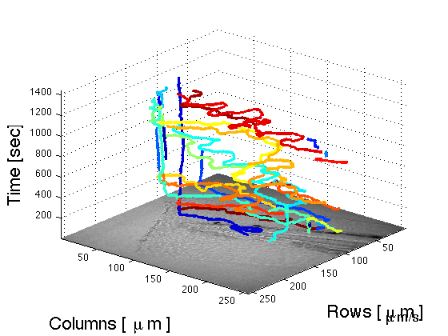
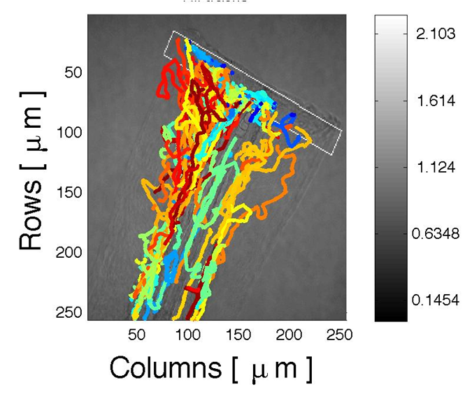
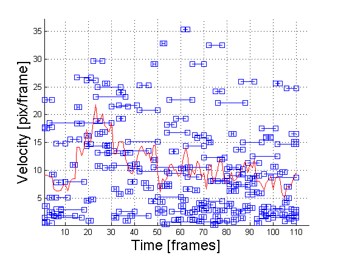

# PhagoSight

<h1><i>PhagoSight</i>: an open-source MATLAB package for the analysis of neutrophils and macrophage migration</h1>

I have developed a very comprehensive software package for the analysis of Neutrophils. The software was published in PLOS ONE:

  Henry, KM, Pase, L, Ramos-Lopez, CF, Lieschke, GJ, Renshaw, SA and Reyes-Aldasoro, CC, "Phagosight: An Open-Source MATLAB® Package for the Analysis of Fluorescent Neutrophil and Macrophage Migration in a Zebrafish Model", PLoS ONE 8(8): e72636.
  <a href="http://www.plosone.org/article/info%3Adoi%2F10.1371%2Fjournal.pone.0072636">
  doi:10.1371/journal.pone.0072636</a>
 

 

  For more details please visit:

<h1> <a href="http://www.phagosight.org" >www.phagosight.org</a></h1>

and the code can be accessed here

<h1> <a href="https://github.com/phagosight" >https://github.com/phagosight</a></h1>

 
 
