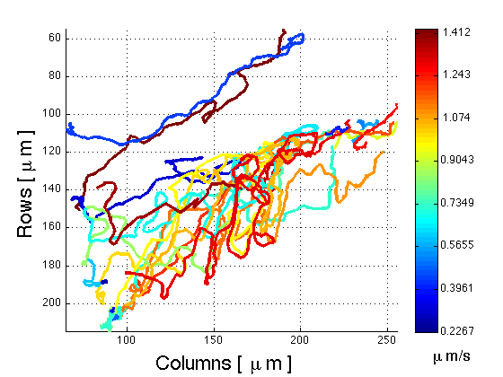

# PhagoSight

<h1><i>PhagoSight</i>: an open-source MATLAB package for the analysis of neutrophils and macrophage migration</h1>

<h2>
I have developed a very comprehensive software package for the analysis of Neutrophils. For more details please visit:
</h2>

<h1> <a href="http://www.phagosight.org" >www.phagosight.org</a></h1>

and the code can be accessed here

<h1> <a href="https://github.com/phagosight" >https://github.com/phagosight</a></h1>

 
 
